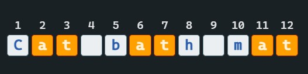
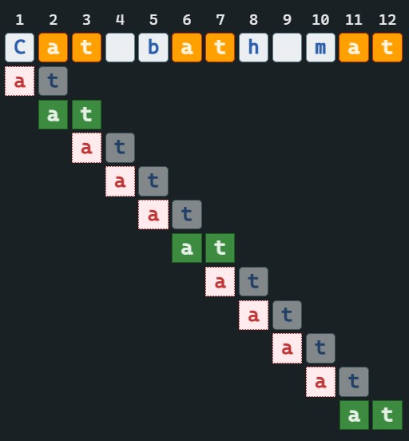
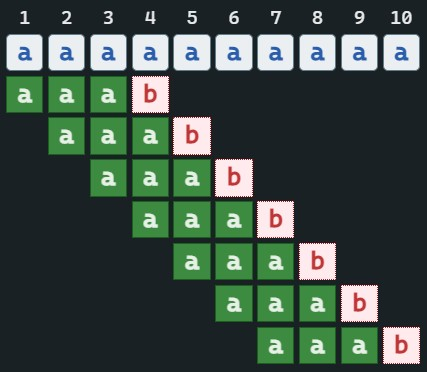

# Семестровая работа по АиСД. Выполнил: Гайфуллин Азамат, группа 11-205.
___

Прежде чем углубиться в детали, давайте разберёмся, что происходит при поиске вхождения образа (подстроки) в строке наивным алгоритмом.

В данной строке будем искать вхождения образа "at"

Наивный алгоритм будет проходить по каждому символу строки, сравнивая образ со строкой. 

Вроде бы всё хорошо, но представим другой случай:

В этом примере никогда не будет совпадения, но наивный алгоритм этого не видит. В наихудшем случае сложность этого алгоритма будет O(n*m), где n - длина данной строки, а m - длина образа.

___
## Алгоритм Кнута-Морриса-Пратта
Подстрока **X** называется ***префиксом*** строки **Y**, если есть такая подстрока **Z**, что **Y=XZ**. Например, подстрока **ab** является префиксом строки **abcfa**.

Подстрока **X** называется ***суффиксом*** строки **Y**, если есть такая подстрока **Z**, что **Y=ZX**. Например, подстрока **fa** является суффиксом строки **abcfa**.

Префикс функция - длина максимального префикса, который также является максимальным суффиксом. Например, для строки **abbabcdfabbac** будет **abba**, длина которого равна 4.
