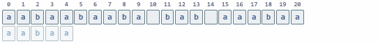

# Семестровая работа по АиСД. Выполнил: Гайфуллин Азамат, группа 11-205.
___

Прежде чем углубиться в детали, давайте разберёмся, что происходит при поиске вхождения образа (подстроки) в строке наивным алгоритмом.


В данной строке будем искать вхождения образа "at"

Наивный алгоритм будет проходить по каждому символу строки, сравнивая образ со строкой. 


Вроде бы всё хорошо, но представим другой случай:


В этом примере никогда не будет совпадения, но наивный алгоритм этого не видит. В наихудшем случае сложность этого алгоритма будет O(n*m), где n - длина данной строки, а m - длина образа.

___
## Алгоритм Кнута-Морриса-Пратта
Подстрока ***X*** называется ***префиксом*** строки ***Y***, если есть такая (непустая) подстрока ***Z***, что ***Y=XZ***. Например, подстрока ***ab*** является префиксом строки ***abcfa***.

Подстрока ***X*** называется ***суффиксом*** строки **Y**, если есть такая подстрока (непустая) ***Z***, что ***Y=ZX***. Например, подстрока ***fa*** является суффиксом строки ***abcfa***.

Бордер - длина максимального префикса, который также является максимальным суффиксом. Например, для строки **abracadabra** бордером будет **abra**, длина которого равна 4.

Префикс-функция (англ. prefix-function) от строки — массив длин наибольших бордеров для каждой позиции этой строки.
Область определения функции - все строки, область значений - массивы неотрицательных целых чисел.
Будем считать, что символы в строках нумеруются с 0.
Определим префикс-функцию от строки s
в позиции i следующим образом: p(s,i)=max{k:s[0…k−1]=s[i−k+1…i]}, где k=1…i. Если мы не нашли такого k, то  p(s,i)=0.

Как наивно построить этот алгоритм?
Проходимся по всем индексам строки, проходимся по префиксам, сравниваем префикс и суффикс на совпадение.

Псевдокод:
``` 
int[] prefixFunction(string s):
    int[] p = int[s.length]
    fill(p, 0) // заполняем массив нулями
    for i = 0 to s.length - 1
        for k = 0 to i - 1
            if s[0..k] == s[i - k..i]
                p[i] = k
    return p
```
**Время работы**
Всего O(n^2) итераций цикла, на каждой из который происходит сравнение строк за O(n), что дает в итоге O(n^3).
___
## Эффективный алгоритм.

### Лемма 1.
    Заметим, что p[i+1] не более чем на 1 больше p[i].
Док-во:
Пусть p[i+1] > p[i+1] + 1, тогда рассмотрим суффикс в позиции i+1, длина которого p[i + 1]. Удалим из него последний символ,
тогда получим p[i+1] - 1 > p[i], **противоречие.**

Напишем этот алгоритм префикс-функции на языке Java:

```java
import java.util.Arrays;
import java.util.Scanner;

public class Main {
    public static void main(String[] args) {
        Scanner in = new Scanner(System.in);
        String string = in.nextLine();
        System.out.println(Arrays.toString(prefixFunction(string)));
    }

    public static int[] prefixFunction(String string) {
        int n = string.length();
        int k;
        //создадим массив, он будет заполнен нулями.
        int[] p = new int[n];
        p[0] = 0;
        for (int i = 1; i < string.length(); i++) {
            k = p[i-1];
            while (k > 0 && string.charAt(i)!=string.charAt(k)){
                k = p[k-1];
            }
            if (string.charAt(i) == string.charAt(k)){
                k++;
            }
            p[i] = k;
        }
        return p;
    }
}
```
Например, Для строки ***abracadabra*** префикс-функцией будет массив **p = [0, 0, 0, 1, 0, 1, 0, 1, 2, 3, 4]**.