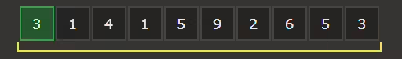
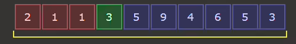
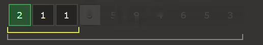
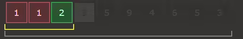
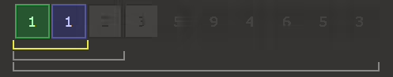

# QuickSort - kasimov
Быстрая сортировка (Quick Sort) является одним их самых эффективных алгоритмов. Отличительной особенностью быстрой сортировки является операция разбиения массива на две части относительно опорного элемента. Например, если последовательность требуется упорядочить по возрастанию, то в левую часть будут помещены все элементы, значения которых меньше значения опорного элемента, а в правую элементы, чьи значения больше или равны опорному. Вне зависимости от того, какой элемент выбран в качестве опорного, массив будет отсортирован, но все же наиболее удачным считается ситуация, когда по обеим сторонам от опорного элемента оказывается примерно равное количество элементов. Если длина какой-то из получившихся в результате разбиения частей превышает один элемент, то для нее нужно рекурсивно выполнить упорядочивание, т. е. повторно запустить алгоритм на каждом из отрезков.

# Оценка сложности:
- В лучшем случае - O(n log n)
- В среднем случае - O(n log n)
- В худшем случае - O(n^2)

#   Принцип работы:

- Из массива выбирается опорный элемент, чаще всего середина массива.
- Другие элементы массива распределяются таким образом, чтобы меньшие размещались до него, а большие — после.
- Далее первые шаги рекурсивно применяются к подмассивам, которые разделились опорным элементом на две части — слева и справа от него.

# Пример алгоритма:
    Исходный массив:

    
    Выбираем опорный компонет, берём 3:

    Теперь разобьём массив на подмассивы: те, что больше трёх и те, что меньше:

    
    То же сделаем с левым подмассивом:

    Выбираем опорный элемент:

    
    Разбиваем на подмассивы:

    
    Проделываем это, пока в подмассиве не останется один элемент.

